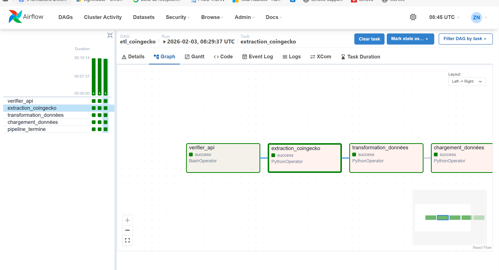

##  Description
Pipeline ETL quotidien orchestré avec Apache Airflow, extractant les données de marché des cryptomonnaies depuis l'API CoinGecko.

##  Pipeline ETL
```
verifier_api → extraction_coingecko → transformation_données → chargement_données → pipeline_termine
```


1. Quels sont les avantages d'un ETL orchestré par rapport à un script exécuté manuellement ?
Un ETL orchestré avec Airflow permet une planification automatique (pas besoin de se souvenir de lancer le script), une gestion automatique des erreurs avec retries, une visualisation claire de l'état du pipeline via la Graph View, une traçabilité complète via les logs, et une meilleure fiabilité en production car les dépendances entre les tâches sont bien définies.
2. Quels risques sont associés à l'appel quotidien d'une API externe ?
Les risques principaux sont le rate limiting (l'API peut bloquer les requêtes si on en fait trop), la disponibilité de l'API externe qui peut être down, les changements de format de données par le fournisseur, et le fait que les données peuvent être inexactes ou incomplètes. C'est pourquoi on a mis en place des retries et une vérification de l'API avant l'extraction.
3. En quoi Airflow se distingue-t-il d'un simple planificateur de tâches ?
Airflow va bien au-delà d'un simple planificateur comme cron. Il permet de gérer les dépendances entre tâches, visualiser les workflows sous forme de graphes, gérer les erreurs avec des retries automatiques, offre une interface web pour monitoring en temps réel, et permet de relancer uniquement les tâches échouées sans avoir à rejouer tout le pipeline.


